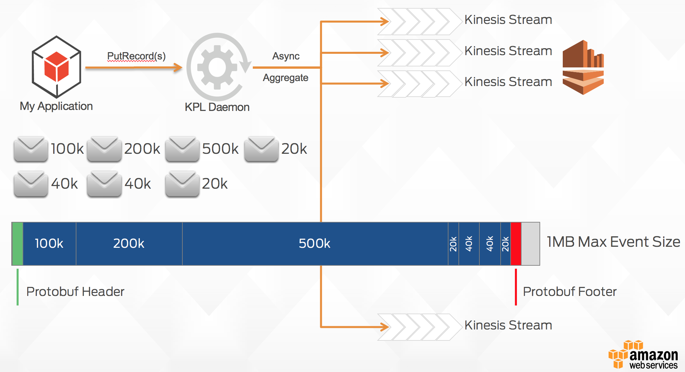
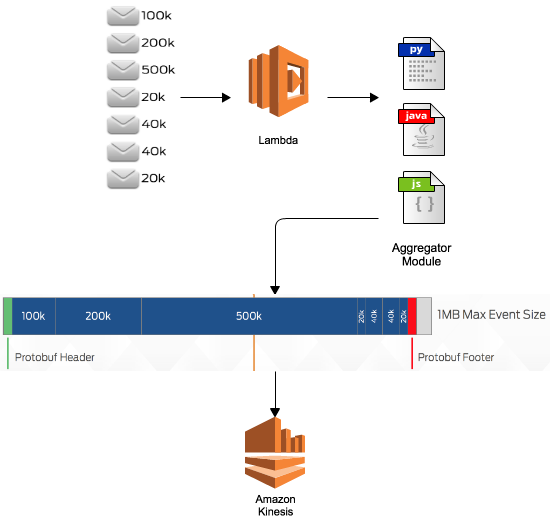
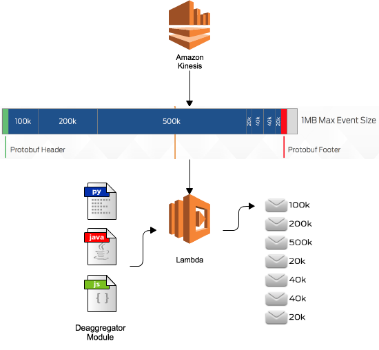

# Kinesis Record Aggregation & Deaggregation Modules for AWS Lambda

The Amazon Kinesis Producer Library (KPL) gives you the ability to write data to Amazon Kinesis with a highly efficient, asyncronous delivery model that can improve performance. The KPL is extremely powerful, but is currently only available as a Java API wrapper around a C++ executable which may not be suitable for all deployment environments. Similarly, the Kinesis Client Library (KCL) provides automatic deaggregation of KPL aggregated records, but not all Kinesis consumer applications, such as those running on AWS Lambda, are currently capable of leveraging this deaggregation capability.

_How the Kinesis Producer Library Publishes Data_

The components in this project give you the ability to process and create KPL compatible serialised data within AWS Lambda, in Java, Node.js and Python. These components can also be used as part of the Kinesis Client Library a [multi-lang KCL application](https://github.com/awslabs/amazon-kinesis-client/blob/master/src/main/java/com/amazonaws/services/kinesis/multilang/package-info.java). However, this project has several limitations:

* It only generates data, and doesn't perform delivery to the stream like the KPL. You still have to call PutRecord(s) to push data to Kinesis Data Streams
* It doesn't manage data across multiple streams like KPL - the interface assumes that all data is sent to a single Stream

## Aggregation

One of the main advantages of the KPL is its ability to use record aggregation to increase payload size and improve throughput. While this project is __not__ a replacement for the full KPL, it does provide you the ability to easily aggregate multiple user records into larger aggregated records that make more efficient use of available bandwidth and reduce cost. This data is encoded using Google Protocol Buffers, and returned to the calling function for subsequent use. You can then publish to Kinesis and the data is compatible with consumers using the KCL or these Deaggregation modules.

### Caution - this module is only suitable for low-value messages which are processed in aggregate. Do not use Kinesis Aggregation for data which is sensitive or where every message must be delivered, and where the KCL (including with AWS Lambda) is used for processing. [DATA LOSS CAN OCCUR.](potential_data_loss.md)

## Deaggregation

The components in this library allow you to efficiently deaggregate protocol buffer encoded aggregated records in any application, including AWS Lambda.
 

### Language Specific Implementations

AWS Lambda supports Java, Node.js, Python and Go as programming languages. We have included support for those languages so that you can create and process UserRecords via standalone modules. Documentation is provided for each language:

| Language | Location |
:--- | :--- 
| Java | [java](java/) |
| Node.js Javascript | [node.js](node/) |
| Python | [python](python/) |
| Go | [go](go/) |

----

Copyright Amazon.com, Inc. or its affiliates. All Rights Reserved.

Licensed under the Apache License, Version 2.0 (the "License");
you may not use this file except in compliance with the License.
You may obtain a copy of the License at

   http://www.apache.org/licenses/LICENSE-2.0

Unless required by applicable law or agreed to in writing, software
distributed under the License is distributed on an "AS IS" BASIS,
WITHOUT WARRANTIES OR CONDITIONS OF ANY KIND, either express or implied.
See the License for the specific language governing permissions and
limitations under the License.
